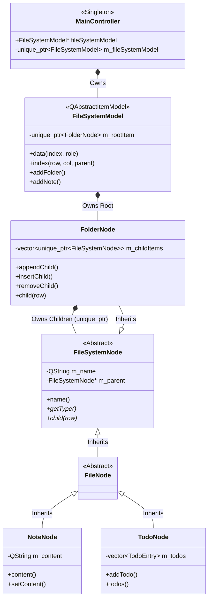

# System Architecture

Here is the current class layout and ownership structure.

### Key Interactions
1.  **Selection**: The GUI (Sidebar) talks to `FileSystemModel`.
2.  **Navigation**: `FileSystemModel` calls `FolderNode::child(row)` to generate Indexes.
3.  **Data**: `FileSystemModel::data()` casts the pointer to `NoteNode*` or `TodoNode*` to access specific getters (`content()`, `todos()`).
